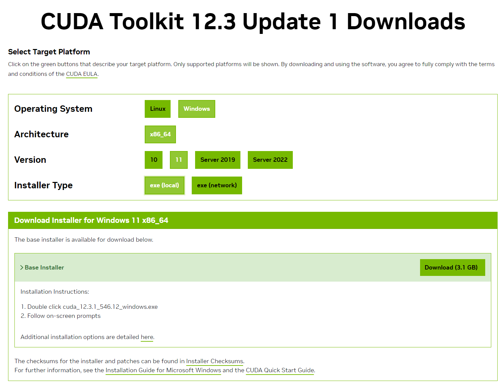
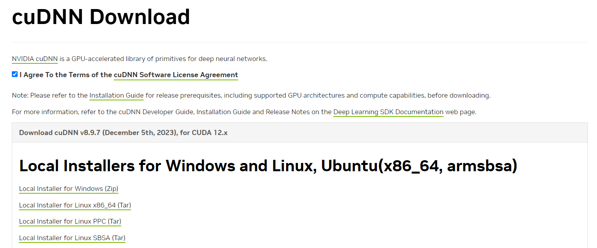
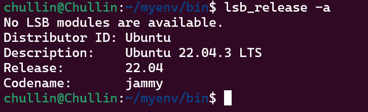
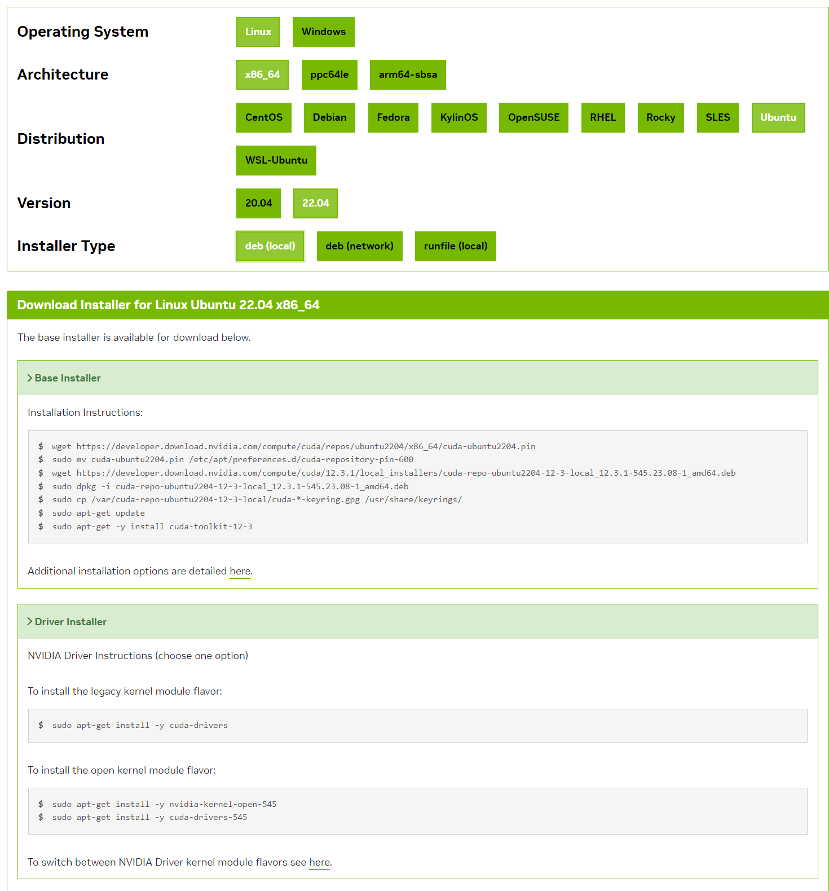
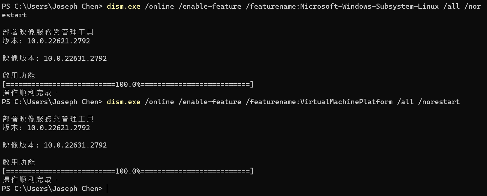
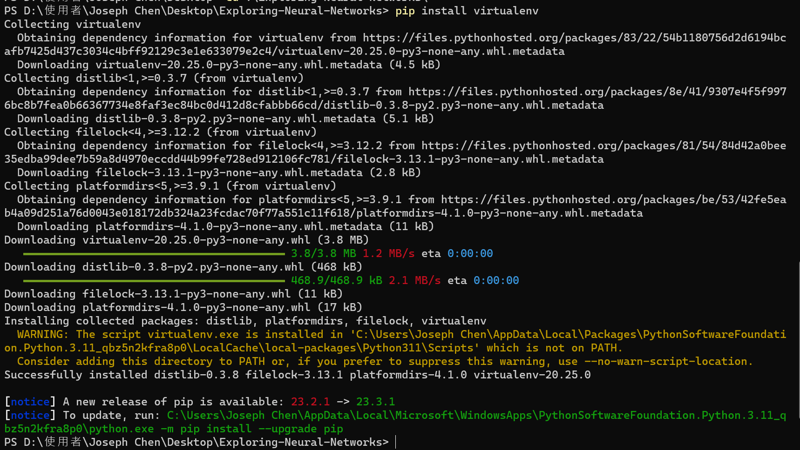

# Exploring-Neural-Networks
Exploring Neural Networks: Playful Adventures with PyTorch and TensorFlow


以下是在使用 GPU 的情況下安裝 TensorFlow 並設置 Python 虛擬環境的一般步驟。請確保您已經安裝了適當的 GPU 驅動程序，並且您的 GPU 支持 CUDA（如果您想要使用 GPU 運行 TensorFlow）。

# (Windows)
## 步驟一：安裝 NVIDIA CUDA Toolkit 和 cuDNN
### 1. 安裝 NVIDIA CUDA Toolkit：
    * 根據您的 GPU 和操作系統版本，從 NVIDIA 官方網站下載並安裝 CUDA Toolkit：https://developer.nvidia.com/cuda-toolkit


### 2. 安裝 cuDNN：
    * 從 NVIDIA 官方網站下載 cuDNN：https://developer.nvidia.com/cudnn

    * 將 cuDNN 解壓縮，將文件複製到 CUDA Toolkit 的安裝目錄中。
    ```
    點開 Toolkit 安裝檔，可以看到路徑C:\Users\JOSEPH~1\AppData\Local\Temp\cuda
    超傻眼...居然一定要用搜尋的
    cudnn-windows-x86_64-8.9.7.29_cuda12-archive
    複製進去
    ```


---
---

# (Linux)

* 結果我用 WSL 系統，需要安裝 Linux 系統的 NVIDIA CUDA Toolkit 跟 cuDNN



```
wget https://developer.download.nvidia.com/compute/cuda/repos/ubuntu2204/x86_64/cuda-ubuntu2204.pin
sudo mv cuda-ubuntu2204.pin /etc/apt/preferences.d/cuda-repository-pin-600
wget https://developer.download.nvidia.com/compute/cuda/12.3.1/local_installers/cuda-repo-ubuntu2204-12-3-local_12.3.1-545.23.08-1_amd64.deb
sudo dpkg -i cuda-repo-ubuntu2204-12-3-local_12.3.1-545.23.08-1_amd64.deb
sudo cp /var/cuda-repo-ubuntu2204-12-3-local/cuda-*-keyring.gpg /usr/share/keyrings/
sudo apt-get update
sudo apt-get -y install cuda-toolkit-12-3
```
* 要安裝舊版核心模組風格：
(我選了這個)
```
sudo apt-get install -y cuda-drivers
```
* 要安裝開放核心模組風格：
```
sudo apt-get install -y nvidia-kernel-open-545
sudo apt-get install -y cuda-drivers-545

```

* 似乎在 windows11 底下的 WSL Ubuntu 22.04 執行還是需要 windows 的 GPU 驅動

## 步驟三：啟用 WSL 2 的 GPU 支持
1. 打開 PowerShell 作為管理員，並執行以下命令以啟用 WSL 2 的 GPU 支持：

```bash
dism.exe /online /enable-feature /featurename:Microsoft-Windows-Subsystem-Linux /all /norestart

dism.exe /online /enable-feature /featurename:VirtualMachinePlatform /all /norestart
```

奇怪的指令真的有用?!

2. 重新啟動計算機。


## 步驟二：創建 Python 虛擬環境
### 1. 安裝虛擬環境管理工具（如果未安裝）：

```bash
pip install virtualenv
```


* 執行
```
C:\Users\"Joseph Chen"\AppData\Local\Microsoft\WindowsApps\PythonSoftwareFoundation.Python.3.11_qbz5n2kfra8p0\python.exe -m pip install --upgrade pip
```
* 然後進到 Path 中，將 .../Scripts 新增到 Path 中
```
C:\Users\Joseph Chen\AppData\Local\Packages\PythonSoftwareFoundation.Python.3.11_qbz5n2kfra8p0\LocalCache\local-packages\Python311\Scripts
```

### 2. 創建虛擬環境：
* (使用 Ubuntu)
    * (terminal 要重開，並且建議使用管理員執行)
    * 感覺用 window 環境還是不太好，後來使用 win11 的 Ubuntu 系統
    *  路徑名稱可以在網路磁碟機中找到，將 /home/usr_name/.local/bin 放到 Path 底下

    * 若已經安裝第一步驟，並且無法執行第二步驟，請先
    ```
    解除安裝：
    pip uninstall virtualenv
    並使用 sudo 安裝：
    sudo pip install virtualenv
    ```
* 創建虛擬環境
```bash
virtualenv myenv
```
### 3. 啟動虛擬環境（Linux/Windows）：
* (Ubuntu)，source 是 shell 命令，用於執行腳本使用
```bash
source myenv/bin/activate
```
* 啟動虛擬環境（Windows）：(需使用命令提示字元，不能使用 PowerShell)
```bash
.\myenv\Scripts\activate
```

### 4. 離開虛擬環境
```
deactivate
```

## 步驟三：安裝 TensorFlow
### 1. 安裝 TensorFlow：
    * 安裝 CPU 版本（如果沒有 GPU）：

```bash
pip install tensorflow
```

### 2. 安裝 GPU 版本（在已經安裝 CUDA 和 cuDNN 的情況下）：

```bash
pip install tensorflow-gpu
```

### 3. Ubuntu 中查看路徑
```
echo $PATH
```

## 步驟四：驗證 TensorFlow 安裝
1. 在 Python 環境中驗證 TensorFlow 安裝：

```python
Copy code
import tensorflow as tf
print(tf.__version__)
```
如果一切順利，您應該看到 TensorFlow 的版本信息。

### 注意事項：
* 如果您使用 Anaconda，可以使用 conda 來創建和管理虛擬環境，但仍然需要通過 pip 安裝 TensorFlow。
* 在 Windows 上，可能需要安裝 Microsoft Visual C++ Redistributable，以便在編譯期間解決一些依賴項。

請注意，這只是一般的步驟，實際操作中可能會因系統配置和軟件版本的不同而有所不同。確保參考 TensorFlow 和 CUDA/cuDNN 的官方文檔以獲取最準確的信息。

