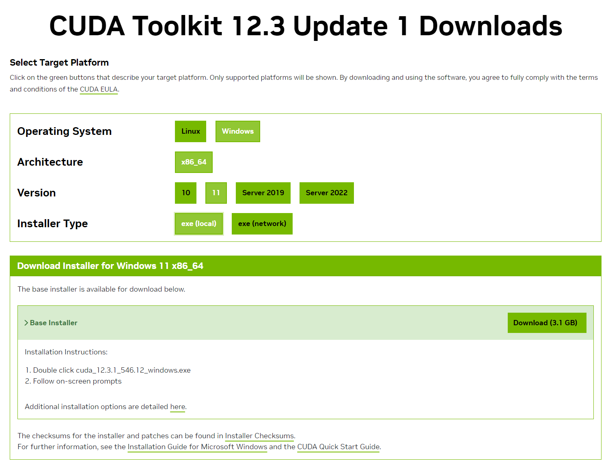
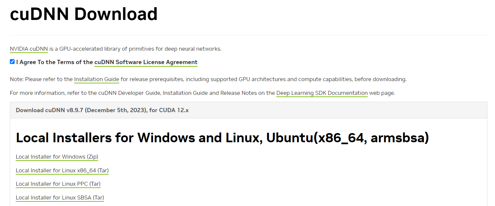
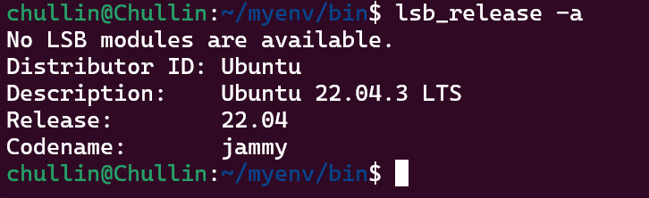
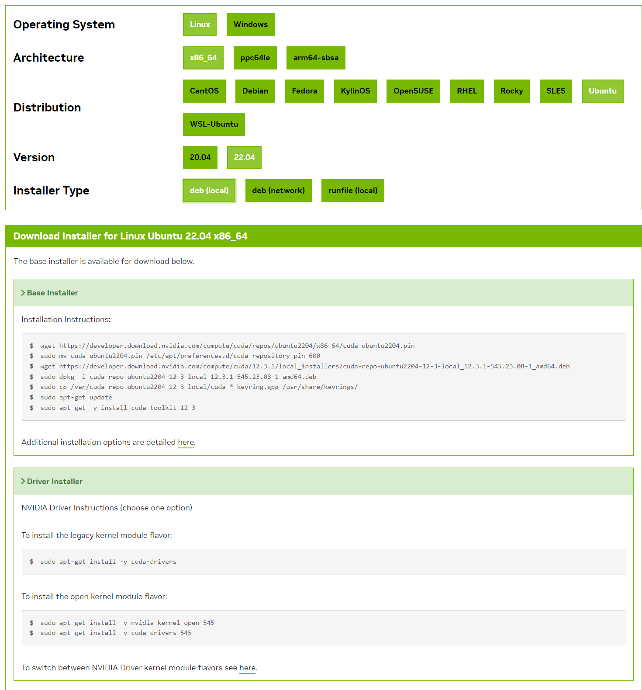
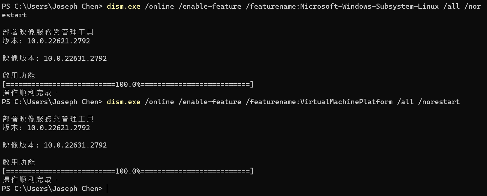
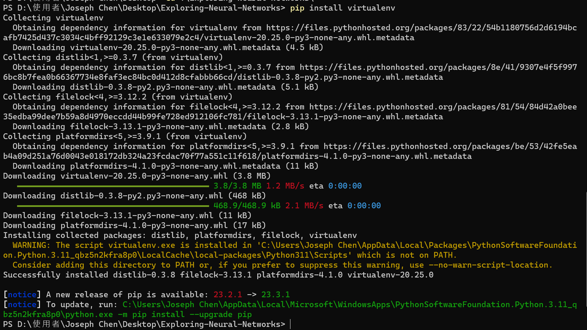
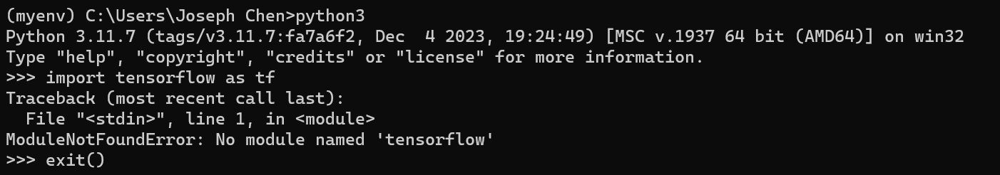
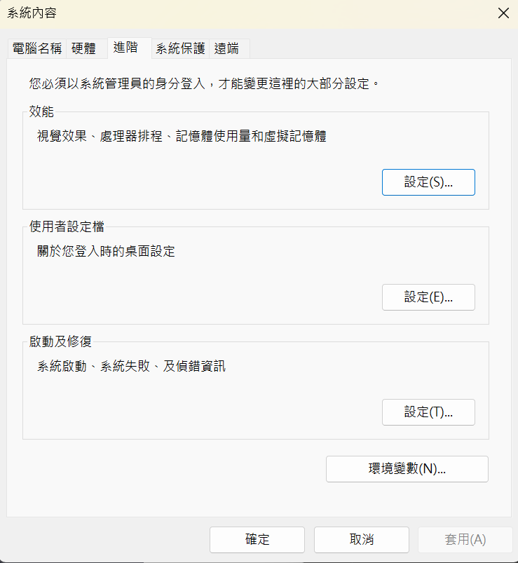
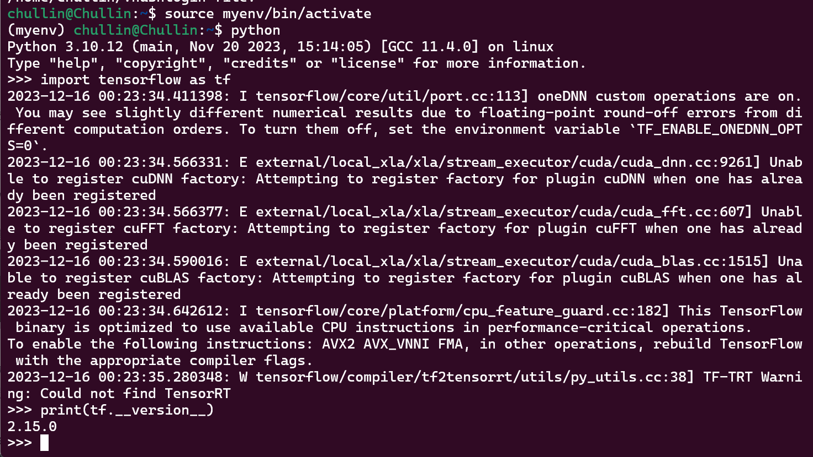
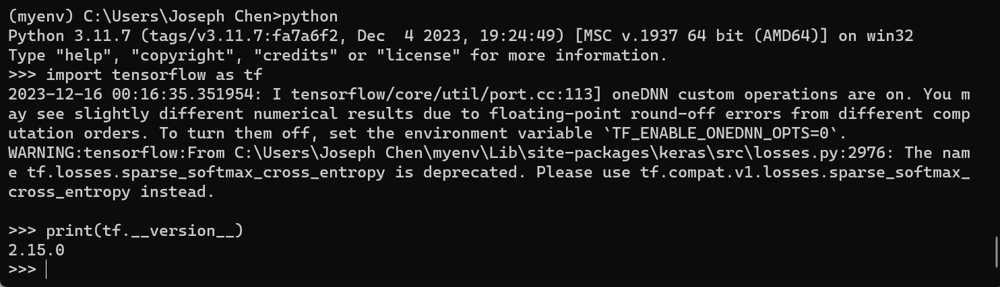

# Exploring-Neural-Networks
Exploring Neural Networks: Playful Adventures with PyTorch and TensorFlow


以下是在使用 GPU 的情況下安裝 TensorFlow 並設置 Python 虛擬環境的一般步驟。請確保您已經安裝了適當的 GPU 驅動程序，並且您的 GPU 支持 CUDA（如果您想要使用 GPU 運行 TensorFlow）。

Complete the installation of CUDA Toolkit, cuDNN, virtualenv, and tensorflow on both system (locol Windows, and WSL Ubuntu)

# (Windows)
## 步驟一：安裝 NVIDIA CUDA Toolkit 和 cuDNN
### 1. 安裝 NVIDIA CUDA Toolkit：
* 根據您的 GPU 和操作系統版本，從 NVIDIA 官方網站下載並安裝 CUDA Toolkit：https://developer.nvidia.com/cuda-toolkit


### 2. 安裝 cuDNN：
* 從 NVIDIA 官方網站下載 cuDNN：https://developer.nvidia.com/cudnn

* 將 cuDNN 解壓縮，將文件複製到 CUDA Toolkit 的安裝目錄中。
```
點開 Toolkit 安裝檔，可以看到路徑C:\Users\JOSEPH~1\AppData\Local\Temp\cuda
超傻眼...居然一定要用搜尋的
cudnn-windows-x86_64-8.9.7.29_cuda12-archive
複製進去
```


---
---

# (Linux)

* 後來我選擇用 WSL 系統，需要安裝 Linux 系統的 NVIDIA CUDA Toolkit 跟 cuDNN



```
wget https://developer.download.nvidia.com/compute/cuda/repos/ubuntu2204/x86_64/cuda-ubuntu2204.pin
sudo mv cuda-ubuntu2204.pin /etc/apt/preferences.d/cuda-repository-pin-600
wget https://developer.download.nvidia.com/compute/cuda/12.3.1/local_installers/cuda-repo-ubuntu2204-12-3-local_12.3.1-545.23.08-1_amd64.deb
sudo dpkg -i cuda-repo-ubuntu2204-12-3-local_12.3.1-545.23.08-1_amd64.deb
sudo cp /var/cuda-repo-ubuntu2204-12-3-local/cuda-*-keyring.gpg /usr/share/keyrings/
sudo apt-get update
sudo apt-get -y install cuda-toolkit-12-3
```
* 要安裝舊版核心模組風格：
(則一；我選了這個)
```
sudo apt-get install -y cuda-drivers
```
* 安裝開放核心模組風格：
```
sudo apt-get install -y nvidia-kernel-open-545
sudo apt-get install -y cuda-drivers-545
```

* 似乎在 windows11 底下的 WSL Ubuntu 22.04 執行還是需要 windows 的 GPU 驅動

## 步驟三：啟用 WSL 2 的 GPU 支持
### 1. 打開 PowerShell 作為管理員，並執行以下命令以啟用 WSL 2 的 GPU 支持：

```bash
dism.exe /online /enable-feature /featurename:Microsoft-Windows-Subsystem-Linux /all /norestart

dism.exe /online /enable-feature /featurename:VirtualMachinePlatform /all /norestart
```

奇怪的指令真的有用?!

### 2. 重新開機


## 步驟二：創建 Python 虛擬環境
### 1. 安裝虛擬環境管理工具（如果未安裝）：

```bash
pip install virtualenv
```


* 執行
```
C:\Users\"Joseph Chen"\AppData\Local\Microsoft\WindowsApps\PythonSoftwareFoundation.Python.3.11_qbz5n2kfra8p0\python.exe -m pip install --upgrade pip
```
* 然後進到 Path 中，將 .../Scripts 新增到 Path 中
```
C:\Users\Joseph Chen\AppData\Local\Packages\PythonSoftwareFoundation.Python.3.11_qbz5n2kfra8p0\LocalCache\local-packages\Python311\Scripts
```

### 2. 創建虛擬環境：
* (使用 Ubuntu)
    * (terminal 要重開，並且建議使用管理員執行)
    * 感覺用 window 環境還是不太好，後來使用 win11 的 Ubuntu 系統
    *  路徑名稱可以在網路磁碟機中找到，將 /home/usr_name/.local/bin 放到 Path 底下

    * 若已經安裝第一步驟，並且無法執行第二步驟，請先
    ```
    解除安裝：
    pip uninstall virtualenv
    並使用 sudo 安裝：
    sudo pip install virtualenv
    ```
* 創建虛擬環境
```bash
virtualenv myenv
```
### 3. 啟動虛擬環境（Linux/Windows）：
* (Ubuntu)，source 是 shell 命令，用於執行腳本使用
```bash
source myenv/bin/activate
```
* 啟動虛擬環境（Windows）：(需使用命令提示字元，不能使用 PowerShell)
```bash
.\myenv\Scripts\activate
```

### 4. 離開虛擬環境
```
deactivate
```

## 步驟三：安裝 TensorFlow
### 1. 安裝 TensorFlow：
    * 安裝 CPU 版本（如果沒有 GPU）：

```bash
pip install tensorflow
```

### 2. 安裝 GPU 版本（在已經安裝 CUDA 和 cuDNN 的情況下）：
(不管是 Windows 還是 Ubuntu 都不行，都要求裝上面的指令)

~~pip install tensorflow-gpu~~


### 3. Ubuntu 中查看路徑
```
echo $PATH
```

## 步驟四：驗證 TensorFlow 安裝
1. 在 Python 環境中驗證 TensorFlow 安裝：

```python
import tensorflow as tf
print(tf.__version__)
```
如果一切順利，您應該看到 TensorFlow 的版本信息。



```
pip3 show tensorflow
```
* 把 Location 加入到 Path 中，指令大概像這樣：
```
export PYTHONPATH=/your/tensorflow/path:$PYTHONPATH.
```
* 當然我還是用貼上的新增


* 可以透過 where 指令查看路徑是否已新增，要確保虛擬環境的路徑出現在套件路徑的前面
```
python -m site
```


### 都確認沒問題還是不行
* 輸入指令，強制更新並重新安裝
```
pip install --upgrade --force-reinstall tensorflow
```

## Ubuntu 成功後 tensorflow 提示

1. TF_ENABLE_ONEDNN_OPTS 警告：

```vbnet
I tensorflow/core/util/port.cc:113] oneDNN custom operations are on. You may see slightly different numerical results due to floating-point round-off errors from different computation orders. To turn them off, set the environment variable `TF_ENABLE_ONEDNN_OPTS=0`.
 ```
這是一個通知，指出 TensorFlow 啟用了 oneDNN（以前稱為 MKL-DNN）自定義操作。由於計算順序的不同，可能會導致輕微的浮點捨入誤差，這可能會使數值結果稍有不同。如果希望禁用，可以設置環境變量 TF_ENABLE_ONEDNN_OPTS=0。

2. cuDNN、cuFFT 和 cuBLAS 警告：


```vbnet
E external/local_xla/xla/stream_executor/cuda/cuda_dnn.cc:9261] Unable to register cuDNN factory: Attempting to register factory for plugin cuDNN when one has already been registered
```
```vbnet
E external/local_xla/xla/stream_executor/cuda/cuda_fft.cc:607] Unable to register cuFFT factory: Attempting to register factory for plugin cuFFT when one has already been registered
```
```vbnet
E external/local_xla/xla/stream_executor/cuda/cuda_blas.cc:1515] Unable to register cuBLAS factory: Attempting to register factory for plugin cuBLAS when one has already been registered
```

這些警告表示 TensorFlow 嘗試註冊 cuDNN、cuFFT 和 cuBLAS 工廠時遇到了問題，因為這些工廠已經註冊過了。這可能是因為你的環境中存在多個 TensorFlow 或者是 TensorFlow 和其他庫之間的衝突。這樣的警告通常可以忽略，但如果你遇到了問題，可能需要檢查環境中的庫版本。

3. CPU 指令優化通知：

```vbnet
I tensorflow/core/platform/cpu_feature_guard.cc:182] This TensorFlow binary is optimized to use available CPU instructions in performance-critical operations. To enable the following instructions: AVX2 AVX_VNNI FMA, in other operations, rebuild TensorFlow with the appropriate compiler flags.
```
這是一個通知，指出這個 TensorFlow 二進制文件是經過優化的，以在性能關鍵操作中使用可用的 CPU 指令。如果希望啟用特定指令，可以使用適當的編譯器標誌重新構建 TensorFlow。

4. TF-TRT 警告：

```vbnet
W tensorflow/compiler/tf2tensorrt/utils/py_utils.cc:38] TF-TRT Warning: Could not find TensorRT
 ```
這個警告表示 TensorFlow 沒有找到 TensorRT，這是一個 NVIDIA 的深度學習加速庫。這可能是因為 TensorRT 沒有被安裝，或者 TensorFlow 版本與 TensorRT 不兼容。如果你需要使用 TensorRT，可以根據 TensorFlow 和 TensorRT 的相容性文檔檢查版本並進行相應的安裝。


看起來好像無傷大雅(?


## Windows 成功後提示


1. oneDNN 自定義操作通知：

```vbnet
 2023-12-16 00:16:35.351954: I tensorflow/core/util/port.cc:113] oneDNN custom operations are on. You may see slightly different numerical results due to floating-point round-off errors from different computation orders. To turn them off, set the environment variable `TF_ENABLE_ONEDNN_OPTS=0`.
```
TensorFlow 使用 oneDNN（以前稱為 MKL-DNN）進行優化的深度學習操作。這個通知提醒你，由於不同計算順序可能導致浮點捨入誤差，你可能會看到略微不同的數值結果。如果希望關閉這個特性，你可以設置環境變量 TF_ENABLE_ONEDNN_OPTS=0。

2. tf.losses.sparse_softmax_cross_entropy 警告：

```vbnet
 WARNING:tensorflow:From C:\Users\Joseph Chen\myenv\Lib\site-packages\keras\src\losses.py:2976: The name tf.losses.sparse_softmax_cross_entropy is deprecated. Please use tf.compat.v1.losses.sparse_softmax_cross_entropy instead.
```
這個警告來自 Keras 模塊，指出 tf.losses.sparse_softmax_cross_entropy 已經被棄用。建議使用 tf.compat.v1.losses.sparse_softmax_cross_entropy 替代。這是因為 TensorFlow 2.x 引入了 Eager Execution 模式，而 tf.losses 被移到了 tf.compat.v1.losses 中，以保持向後兼容性。在新的代碼中，你應該使用 tf.keras.losses.sparse_categorical_crossentropy 作為替代。

例如：

```python
 # 舊的用法（已棄用）
tf.losses.sparse_softmax_cross_entropy(...)

# 新的用法
tf.compat.v1.losses.sparse_softmax_cross_entropy(...)  # 或者使用 tf.keras.losses.sparse_categorical_crossentropy
```
你可以根據警告中的建議更新你的代碼，以避免使用已棄用的函數。